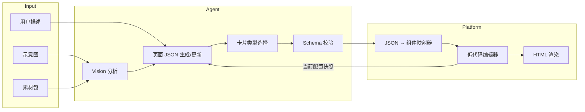

# AI 页面生成 Agent：可行性分析与实现方案

> 面向低代码页面搭建平台的「示意图 → 组件配置 → 可编辑页面」能力设计文档。  
> 参考 A2UI 的 Catalog + Schema + Examples 模式，结合多模态视觉理解能力。

---

## 1. 背景与目标

### 1.1 现有能力

平台已具备完整的低代码搭建链路：

| 能力 | 说明 |
|------|------|
| 组件库 | 图标、背景图、按钮、文字、可点击热区等 |
| 可视化编辑 | 拖拽、改位置/大小/字体/颜色/图片地址 |
| 配置持久化 | 组件配置存库，可反复修改并预览 HTML 页面 |

### 1.2 期望新增能力

```
用户上传示意图 + 素材图片
        ↓
   模型分析页面结构
        ↓
  生成「页面描述 JSON」
        ↓
  前端 JSON → 平台组件配置
        ↓
  用户进入编辑器继续微调
        ↓
  用户用自然语言描述修改需求
        ↓
  模型增量修改 JSON → 前端重新渲染
```

### 1.3 目标分层

| 阶段 | 目标 | 核心特征 |
|------|------|----------|
| **初期（MVP）** | 固定页面骨架 + 卡片类型选择 + 填内容 | 模型在头图/章节/卡片骨架上选卡片类型并填素材文案 |
| **中期** | 示意图结构识别 + 组件映射 | 视觉模型识别布局，映射到平台组件 |
| **最终** | 端到端生成 + 迭代修改 | 任意页面示意图 → 高保真可编辑页面，多轮对话精修 |

---

## 2. 可行性分析

### 2.1 初期目标（固定骨架 + 卡片选型 + 内容填充）

**结论：高度可行，建议作为第一版上线。**

| 维度 | 评估 |
|------|------|
| 技术成熟度 | A2UI `restaurant_finder` 已验证：给模型 Schema + Examples + 规则，模型可稳定输出合法 JSON |
| 模型能力 | 纯文本/结构化输出场景，合规网关内的主流模型即可胜任（见 §8） |
| 开发成本 | 低：定义 Catalog、写 1 个完整 few-shot 示例、Prompt + 校验即可 |
| 准确率预期 | 结构正确率 >95%；文案/素材匹配 >85%（有人工微调兜底） |

**A2UI 已验证的模式（可直接借鉴）：**

```python
# restaurant_finder/prompt_builder.py 的核心思路
schema_manager = A2uiSchemaManager(
    version=VERSION_0_9,
    catalogs=[BasicCatalog.get_config(version, examples_path="examples/0.9")],
    # 实战经验：过严的 Schema（如 additionalProperties: false）会显著拉低合法率，
    # A2UI 在注入前统一放宽（agent.py / prompt_builder.py 均带此修饰器）
    schema_modifiers=[remove_strict_validation],
).generate_system_prompt(
    role_description=ROLE_DESCRIPTION,
    ui_description=UI_DESCRIPTION,      # 组件/卡片使用规则
    include_schema=True,                # 注入 JSON Schema
    include_examples=True,              # 注入 few-shot 示例
    validate_examples=True,
)
```

A2UI 的 `restaurant_finder` 是「**模型在多个页面模板间选择**（单列/双列/表单）+ 用 `updateDataModel` 做数据绑定填充」。你们**借鉴其数据绑定、但简化模板选择**：

1. **不做多模板选择** —— 全局只有一个页面骨架（头图 + 内容区）
2. **引入数据绑定，且文案与图片地址分离** —— 借鉴 A2UI 的「结构 / 数据分离」：`components[]` 只描述结构，组件属性用 `{ "path": "/texts/..." }` 或 `{ "path": "/images/..." }` 引用，真实内容集中放在 `data.texts`（文案）和 `data.images`（图片地址）两个命名空间
3. 模型的工作是：在固定骨架内**为每个卡片槽位选择合适的卡片 component 类型**，并填好 `data.texts` / `data.images`，输出经 Schema 校验的 JSON

**映射到你们的平台：**

- A2UI 的 `Catalog` → 你们的「组件 / 卡片类型定义」（Header、Chapter、TextCard、IconCard、BackgroundTextCard…）
- A2UI 的 `Examples` → 你们的「平铺 components[] 示例」（语义上头图 / 章节 / 卡片，结构上邻接表）
- A2UI 的 `updateDataModel`（数据绑定） → 你们**采用并细分**为 `data.texts`（文案）与 `data.images`（图片 url + 元数据）两个数据区

> **关键设计（务必记住）**：页面 JSON 把「结构」和「数据」分离——`components[]` 里的文案/图片字段写 `path` 引用，实际值放在 `data` 里，且**文案和图片地址各占一个独立命名空间**。这样可以「只改文案不动图」「只换素材不动文案」，多轮修改与合规审核都更聚焦。详见 [§3.6 数据绑定](#36-数据绑定文案--图片分离)。

### 2.2 中期目标（示意图结构识别）

**结论：可行，但需分模块降低风险。**

| 子能力 | 可行性 | 说明 |
|--------|--------|------|
| 区块检测（header/banner/list/footer） | 高 | 主流多模态模型可识别常见布局（具体厂商以 Eval 实测定，见 §8） |
| 文字 OCR + 位置估计 | 中高 | 模型可读图中文案；精确像素坐标需后处理或规则校正 |
| 素材与示意图元素匹配 | 中 | 需素材清单 + 语义匹配（文件名/用户标注/视觉相似度） |
| 像素级还原 | 低 | 不建议作为目标；应定位为「结构还原 + 可编辑起点」 |

**推荐架构：两阶段 Pipeline，而非一步到位**

```
阶段 A（视觉理解）          阶段 B（结构化生成）
─────────────────          ─────────────────
示意图 + 素材列表    →    页面 JSON 草稿（结构 + 已识别内容）
                           ↓
                      补全卡片类型与素材引用
                           ↓
                      校验 + 输出最终页面 JSON
```

Vision 阶段直接产出**与最终页面 JSON 同构**的草稿（头图 / 章节 / 卡片的平铺 components），只填「识别到的内容」；生成阶段补全卡片 component 类型选择与素材引用。无需独立的中间表示（IR）格式。示例见 [§3.4 页面 JSON 结构定义](#34-页面-json-结构定义)。

前端或后端 `页面 JSON → 平台组件配置` 的映射层用确定性代码实现，**不让模型直接输出平台私有格式**，可显著降低幻觉和回归风险。

### 2.3 最终目标（端到端 + 多轮迭代修改）

**结论：长期可行，依赖中期基建 + 编辑器闭环。**

| 能力 | 可行性 | 关键依赖 |
|------|--------|----------|
| 首次生成可编辑页面 | 中高 | 中期 Pipeline + 卡片库 + 坐标归一化 |
| 自然语言增量修改 | 高 | 维护「当前页面 JSON」为会话状态，模型做 patch 而非全量重写 |
| 高保真视觉还原 | 中低 | 需设计 token（间距/字号档位）约束，接受「近似 + 人工微调」 |
| 复杂交互（热区跳转、按钮动作等） | 中 | 需在 Catalog 中显式建模，并在 Prompt 中说明语义 |

**最终形态的数据流：**



---

## 3. 核心设计：页面 JSON 平铺契约（对齐 A2UI）

A2UI 的核心洞察：**Agent 与前端之间靠 Schema 契约通信，UI 用邻接表平铺描述，树结构通过 id 引用拼装。**

你们的页面 JSON **采用与 A2UI 相同的平铺模型**：所有节点放在 `components[]` 数组中，每个节点有唯一 `id` 和 `component` 类型，容器通过 `children: ["id1", "id2"]` 引用子节点。业务语义上的头图 / 章节 / 卡片，对应不同的 `component` 类型，而非嵌套对象。

**概念层级（语义）与 JSON 形态（平铺）的对应关系：**

```
语义层级                          JSON 中的 component 类型
─────────────────────────────────────────────────────────
页面 (Page)                       Page（id: root）
├── 头图 (Header)                 Header
│   ├── 背景图                    BackgroundImage
│   ├── 主标题 / 副标题           Text（含 position / size）
│   └── 小图标                    Icon（含 position / size）
└── 章节 (Chapter) × N            Chapter
    ├── 章节背景图（可选）         BackgroundImage
    ├── 章节标题（可选）           Text（含 position / size）
    └── 内容卡片 × M              TextCard / IconCard / BackgroundTextCard
```

参考 A2UI `single_column_list.json`：组件定义顺序任意，客户端按 `id` 建 Map 后从 `root` 递归还原树。

### 3.1 三层结构

```
┌─────────────────────────────────────────────────────────┐
│  Layer 1: 组件 Catalog（component Schema）              │
│  Page / Header / Chapter + TextCard / IconCard …          │
│  模型任务：为每个槽位选择 component 类型并填属性           │
└─────────────────────────────────────────────────────────┘
                          ↓
┌─────────────────────────────────────────────────────────┐
│  Layer 2: 页面 JSON = 结构 + 数据                         │
│  · components[]：平铺邻接表，文案/图片字段写 path 引用      │
│  · data.texts：文案命名空间                                │
│  · data.images：图片命名空间（直接存 url + 元数据）         │
│  模型任务：输出组件树 + 填好两个数据区                     │
└─────────────────────────────────────────────────────────┘
                          ↓
┌─────────────────────────────────────────────────────────┐
│  Layer 3: Platform Config（平台原生配置）                 │
│  Mapper 还原树 + 解析 path → 展开为前端基础组件列表        │
│  （文字 / 背景图 / 图标 / 按钮…，见 §3.3 对应表）          │
│  用户后续在编辑器里的改动写回 Layer 3                      │
└─────────────────────────────────────────────────────────┘
```

**设计约定：**

- **不加 `version` 字段** — 页面 JSON 是业务数据，版本演进由 Schema 文件和 Mapper 代码管理，不在每份页面数据里携带协议版本号。待项目稳定、Schema 真正开始演进时，再评估是否在页面记录的 DB 列（而非 JSON 体）加 `schemaVersion`。
- **MVP 只有一个页面 JSON 骨架** — 不需要「活动页 / 产品页」等多模板选择；变化体现在**章节有几节、每节放几张什么类型的卡片**。
- **卡片类型可扩展** — 初期提供若干卡片 Schema 供模型选择；新增卡片类型只需扩展 Catalog + Mapper，不必改页面骨架。

### 3.2 为何不建议模型直接输出平台配置

| 直接输出平台配置 | 通过页面 JSON + Mapper |
|------------------|------------------------|
| 模型需记住平台所有字段 id、枚举、嵌套规则 | 模型只需理解头图 / 章节 / 卡片语义 |
| 一次改平台 schema，Prompt 全量失效 | Mapper 适配，Agent 层基本不变 |
| 难以做 Schema 校验 | JSON Schema 可严格校验 |
| 多轮修改容易「漂移」整个页面 | 可按组件 `id` 定位后做 JSON Patch |

### 3.3 组件 Catalog

> **重要区分：Catalog 组件是页面 JSON 的语义组件，不是平台前端组件。** 平台前端实际可用的是文字组件、背景图组件、图标组件、按钮组件、可点击热区组件等基础组件；页面 JSON 里的 Page / Header / Chapter / 各类卡片是给模型用的「描述词汇」，由 Mapper（Layer 3）展开成前端基础组件的组合：
>
> | 页面 JSON 组件 | Mapper 展开后的前端组件 |
> |---------------|------------------------|
> | `Page` / `Header` / `Chapter` | 不直接产出前端组件，只是排版容器（决定区域位置与排布范围） |
> | `BackgroundImage` | 背景图组件 ×1 |
> | `Text` | 文字组件 ×1 |
> | `Icon` | 图标组件 ×1 |
> | `TextCard` | 文字组件 ×1（套卡片默认样式） |
> | `IconCard` | 图标组件 ×1 + 文字组件 ×1~2（标题 / 说明） |
> | `BackgroundTextCard` | 背景图组件 ×1 + 文字组件 ×1 |
>
> 例如头图区域最终在前端是「一个背景图组件 + 若干文字组件（主/副标题）+ 若干图标组件」，`Header` 本身不出现在编辑器组件列表里。这层翻译是确定性代码，模型完全不感知前端组件的字段格式。

与 A2UI 一致，每种 `component` 类型在 Catalog 中单独定义属性 Schema。全部组件如下：

**容器组件（通过 `children` 引用子节点 id）：**

| component | 说明 | children 约定 |
|-----------|------|---------------|
| `Page` | 页面根节点，id 固定为 `root` | Header + 若干 Chapter |
| `Header` | 头图区域，全页唯一 | BackgroundImage + Text（主/副标题）+ Icon… |
| `Chapter` | 内容章节 | BackgroundImage? + Text?（标题）+ 若干 Card |

**叶子组件**（标注 🔤 的属性绑定到 `/texts`，标注 🖼 的绑定到 `/images`，均写 `{ "path": "..." }`）：

| component | 说明 | 主要属性 |
|-----------|------|----------|
| `BackgroundImage` | 背景图（铺满父容器，决定父容器高度） | 🖼`src`, `height?` |
| `Text` | 文字（主标题、副标题、章节标题） | 🔤`content`, `style?`, `position?`, `size?` |
| `Icon` | 头图小图标 | 🖼`src`, `alt?`, `position?`, `size?` |
| `TextCard` | 纯文字卡片 | 🔤`content`, `style?` |
| `IconCard` | 图标卡片 | 🖼`src`, 🔤`title?`, 🔤`description?`, `style?` |
| `BackgroundTextCard` | 有背景图的文字卡片 | 🖼`backgroundImage`, 🔤`content`, `style?` |

> 卡片不再用 `type` 字段区分，而是与 A2UI 一样直接用 `component` 字段（如 `"component": "IconCard"`）。  
> 后续扩展 `HotZoneCard`、`ButtonCard` 等，只需在 Catalog 中新增组件定义。  
> **凡是文案与图片地址字段，都不内联值，而是写 `path` 引用**（见 §3.6）；`style` / `position` / `size` / `height` / `alt` 等结构与样式属性仍内联在组件上。

**`Icon` 与 `IconCard` 的区别（勿混淆）：**

| | `Icon` | `IconCard` |
|--|--------|------------|
| 所在区域 | 头图 Header | 章节 Chapter 内 |
| 定位 | 绝对定位（`position?` / `size?`，缺省走 Mapper 预设） | 流式排版（卡片堆叠） |
| 语义 | 头图上的装饰小图标 | 一张「图标 + 标题/说明」的内容卡片 |

**`BackgroundImage` 的尺寸约定：** 背景图**宽度固定为设计稿宽（375px）**、水平铺满其所在的 Header / Chapter 容器。高度规则按容器区分：

- **Header 内**：可选 `height`（px）决定头图区域高度，不填时由 Mapper 按图片原始比例换算。该高度决定头图内 Text、Icon 的可用画布。
- **Chapter 内**：**章节高度由内部内容（标题 + 卡片流式排版结果）撑开**，背景图拉伸或裁切至该高度；`height` 字段在章节背景上不生效（见 §3.5.2）。

**统一 `style` 字段（`Style` 对象）：** 所有带 `style?` 的组件共用同一套样式键，未列出的键不接受：

| 键 | 类型 | 说明 |
|----|------|------|
| `fontSize` | number | 字号（px） |
| `color` | string | 文字颜色（十六进制，如 `#FFFFFF`） |
| `fontWeight` | `"normal"` \| `"bold"` | 字重 |
| `textAlign` | `"left"` \| `"center"` \| `"right"` | 水平对齐 |
| `lineHeight` | number | 行高（px，可选） |

> `style` 仅描述**文字呈现**；位置和尺寸一律用 `position` / `size`，不混入 style。新增样式键需同步扩展 Catalog Schema 与 Mapper。

**交互 / 动作（MVP 暂不建模）：** 现有平台支持按钮、可点击热区等带跳转的交互组件，但 **MVP 的 Catalog 只覆盖展示型组件**（不含 action）。这样可先跑通「生成 → 编辑 → 发布」主链路。后续接入交互时，按 A2UI 的 `action` 约定为相关组件（如未来的 `ButtonCard` / `HotZoneCard`）增加可选 `action` 字段：

```json
{ "id": "cta", "component": "ButtonCard", "label": "立即参与",
  "action": { "type": "link", "target": "https://example.com/activity" } }
```

`action.type` 预留 `link`（跳转）/ `scroll`（页内锚点）/ `submit`（提交）等枚举，由 Mapper 映射到平台的热区/按钮动作配置。

### 3.4 页面 JSON 结构定义

#### 3.4.1 顶层结构

```json
{
  "components": [ ... ],
  "data": {
    "texts":  { ... },
    "images": { ... }
  }
}
```

| 字段 | 说明 |
|------|------|
| `components` | **平铺**的组件列表（邻接表），顺序不限；文案/图片字段写 `path` 引用 |
| `data.texts` | 文案命名空间：`{ "key": "文案字符串" }` |
| `data.images` | 图片命名空间：`{ "key": { "url": "...", "name": "..." } }`，直接存真实 url 与元数据 |

每个组件对象的通用结构（对齐 A2UI）：

```json
{
  "id": "唯一标识",
  "component": "组件类型名",
  "content": { "path": "/texts/xxx" },   // 文案：绑定到 data.texts
  "src":     { "path": "/images/yyy" },  // 图片：绑定到 data.images
  "style": { ... }, "position": { ... }, "size": { ... },
  "children": ["子组件id1", "子组件id2"]
}
```

- `id`：必填，全页唯一
- `component`：必填，Catalog 中定义的类型名
- 文案/图片字段：写 `{ "path": "/texts/..." }` 或 `{ "path": "/images/..." }`，不内联值
- `children`：容器组件必填，叶子组件不出现此字段

#### 3.4.2 头图区域（Header 子树）

头图通过 `Header` 容器组件组织，`children` 列出其下所有子节点 id：

```json
// components 里只写结构 + path 引用：
{ "id": "header-1", "component": "Header", "children": ["header-bg", "main-title", "sub-title", "icon-1", "icon-2"] },
{ "id": "header-bg",   "component": "BackgroundImage", "src": { "path": "/images/headerBg" } },
{ "id": "main-title",  "component": "Text", "content": { "path": "/texts/mainTitle" },
  "style": { "fontSize": 28, "color": "#FFFFFF", "fontWeight": "bold" },
  "position": { "x": 24, "y": 80 }, "size": { "width": 280, "height": 40 } },
{ "id": "sub-title",   "component": "Text", "content": { "path": "/texts/subTitle" },
  "style": { "fontSize": 14, "color": "#FFFFFF" },
  "position": { "x": 24, "y": 128 }, "size": { "width": 280, "height": 24 } },
{ "id": "icon-1", "component": "Icon", "src": { "path": "/images/activityBadge" }, "alt": "活动标识",
  "position": { "x": 16, "y": 12 }, "size": { "width": 40, "height": 40 } },
{ "id": "icon-2", "component": "Icon", "src": { "path": "/images/brandLogo" }, "alt": "品牌 logo",
  "position": { "x": 319, "y": 12 }, "size": { "width": 32, "height": 32 } }
```

对应的数据区：

```json
"data": {
  "texts": {
    "mainTitle": "新春理财季",
    "subTitle":  "稳健收益 安心之选"
  },
  "images": {
    "headerBg":      { "url": "https://cdn.example.com/header_bg.png", "name": "header_bg.png" },
    "activityBadge": { "url": "https://cdn.example.com/badge.png",     "name": "badge.png" },
    "brandLogo":     { "url": "https://cdn.example.com/logo.png",      "name": "logo.png" }
  }
}
```

| 组件 | 必填 | 说明 |
|------|------|------|
| `header-bg`（BackgroundImage） | 是 | 头图背景 |
| `main-title`（Text） | 是 | 主标题 |
| `sub-title`（Text） | 否 | 副标题，不需要时可不放 id 进 children |
| `icon-*`（Icon） | 否 | 头图装饰图标，可有 0 到多个 |

**Text / Icon 共有属性（位置与尺寸）：**

| 属性 | 类型 | 必填 | 说明 |
|------|------|------|------|
| `position` | `{ x, y }` | 否 | 相对**父级背景图**左上角坐标（px，设计稿宽 375）；MVP 不输出，Phase 2 由 Vision 提供 |
| `size` | `{ width, height }` | 否 | 组件占位宽高（px）；缺省时与 `position` 一并由 Mapper 布局预设决定 |

坐标参照系约定：

| 所在区域 | 组件 | position / size 参照 |
|----------|------|----------------------|
| Header | 主标题、副标题、Icon | 相对头图背景图（如 `header-bg`）左上角 |
| Chapter | 章节标题 | 相对章节背景图（如 `chapter-bg-*`）左上角 |
| Chapter | 卡片组件 | 相对章节背景图左上角；MVP 若卡片采用自动流式排版，可由 Mapper 计算 |

如果某个 Chapter 没有显式 `BackgroundImage`，则以该 Chapter 容器自身的左上角作为参照。

**Icon 额外属性：**

| 属性 | 类型 | 必填 | 说明 |
|------|------|------|------|
| `src` | ValueRef | 是 | `{ "path": "/images/<key>" }`，绑定到 `data.images` |
| `alt` | string | 否 | 辅助素材匹配 |

> **MVP（无 Vision）阶段模型不输出 position / size**：纯文本模型凭空发明像素坐标只会产出凌乱布局。缺省时由 Mapper 套用布局预设（如主标题在头图垂直居中、副标题在其下方 8px、Icon 默认贴角）。Phase 2 接入 Vision 后由视觉识别提供坐标，按上表参照系填写。卡片类组件在 MVP 中继续由 Mapper 按章节内流式排版自动计算；如果后续需要更高还原度，也可以给卡片组件增加 `position` / `size`，参照系同样是章节背景图。

#### 3.4.3 章节区域（Chapter 子树）

**有标题的章节** — `children` 包含背景、标题和卡片 id（文案/图片均为 path 引用）：

```json
{ "id": "chapter-1", "component": "Chapter",
  "children": ["chapter-bg-1", "chapter-title-1", "card-bg-text-1", "card-text-1"] },
{ "id": "chapter-bg-1",    "component": "BackgroundImage", "src": { "path": "/images/chapterBg1" } },
{ "id": "chapter-title-1", "component": "Text", "content": { "path": "/texts/chapter1Title" },
  "style": { "fontSize": 20, "color": "#333333", "fontWeight": "bold" },
  "position": { "x": 16, "y": 16 }, "size": { "width": 343, "height": 28 } },
{ "id": "card-bg-text-1", "component": "BackgroundTextCard",
  "backgroundImage": { "path": "/images/cardBg1" }, "content": { "path": "/texts/card1Text" },
  "style": { "fontSize": 18, "color": "#FFFFFF", "fontWeight": "bold" } },
{ "id": "card-text-1", "component": "TextCard", "content": { "path": "/texts/card2Text" },
  "style": { "fontSize": 12, "color": "#999999" } }
```

**无标题、仅卡片的章节（合法）** — `children` 只列卡片 id：

```json
{ "id": "chapter-2", "component": "Chapter", "children": ["card-icon-1", "card-text-2"] },
{ "id": "card-icon-1", "component": "IconCard", "src": { "path": "/images/cardIcon1" },
  "title": { "path": "/texts/iconCardTitle" }, "description": { "path": "/texts/iconCardDesc" } },
{ "id": "card-text-2", "component": "TextCard", "content": { "path": "/texts/card3Text" },
  "style": { "fontSize": 12, "color": "#666666" } }
```

| 规则 | 说明 |
|------|------|
| `Chapter.children` | 至少包含 1 个卡片组件 id；背景图、标题 id 可选 |
| 无标题 | 不在 `children` 中放 Text 节点即可 |
| 无背景 | 不在 `children` 中放 BackgroundImage 节点即可 |

#### 3.4.4 完整页面骨架示例（平铺）

```json
{
  "components": [
    { "id": "root", "component": "Page", "children": ["header-1", "chapter-1", "chapter-2"] },

    { "id": "header-1", "component": "Header", "children": ["header-bg", "main-title", "sub-title", "icon-1"] },
    { "id": "header-bg",  "component": "BackgroundImage", "src": { "path": "/images/headerBg" }, "height": 200 },
    { "id": "main-title", "component": "Text", "content": { "path": "/texts/mainTitle" },
      "style": { "fontSize": 28, "color": "#FFFFFF" },
      "position": { "x": 24, "y": 80 }, "size": { "width": 280, "height": 40 } },
    { "id": "sub-title", "component": "Text", "content": { "path": "/texts/subTitle" },
      "style": { "fontSize": 14, "color": "#FFFFFF" },
      "position": { "x": 24, "y": 128 }, "size": { "width": 280, "height": 24 } },
    { "id": "icon-1", "component": "Icon", "src": { "path": "/images/badge" }, "alt": "活动角标",
      "position": { "x": 16, "y": 16 }, "size": { "width": 48, "height": 48 } },

    { "id": "chapter-1", "component": "Chapter", "children": ["chapter-title-1", "card-bg-text-1"] },
    { "id": "chapter-title-1", "component": "Text", "content": { "path": "/texts/chapter1Title" },
      "style": { "fontSize": 20 },
      "position": { "x": 16, "y": 16 }, "size": { "width": 343, "height": 28 } },
    { "id": "card-bg-text-1", "component": "BackgroundTextCard",
      "backgroundImage": { "path": "/images/cardBg1" }, "content": { "path": "/texts/card1Text" } },

    { "id": "chapter-2", "component": "Chapter", "children": ["card-icon-1", "card-text-1"] },
    { "id": "card-icon-1", "component": "IconCard", "src": { "path": "/images/cardIcon1" },
      "title": { "path": "/texts/iconCardTitle" } },
    { "id": "card-text-1", "component": "TextCard", "content": { "path": "/texts/card2Text" } }
  ],
  "data": {
    "texts": {
      "mainTitle":     "新春理财季",
      "subTitle":      "稳健收益 安心之选",
      "chapter1Title": "热门产品",
      "card1Text":     "新客专享活动",
      "iconCardTitle": "安心精选",
      "card2Text":     "活动规则说明……"
    },
    "images": {
      "headerBg":  { "url": "https://cdn.example.com/header_bg.png", "name": "header_bg.png" },
      "badge":     { "url": "https://cdn.example.com/badge.png",     "name": "badge.png" },
      "cardBg1":   { "url": "https://cdn.example.com/card_bg.png",   "name": "card_bg.png" },
      "cardIcon1": { "url": "https://cdn.example.com/card_icon.png", "name": "card_icon.png" }
    }
  }
}
```

> 注：本示例为演示完整 Schema 而带上了 Text / Icon 的 `position` / `size`（Phase 2 形态）。**MVP 的 few-shot 应使用附录 A**——不含 Text / Icon 坐标，布局交由 Mapper 预设。

#### 3.4.5 为何平铺更适合 LLM 生成

| 嵌套对象/数组（早期方案） | A2UI 平铺邻接表（当前方案） |
|---------------|-----------------|
| 深层嵌套易漏括号、难增量修改 | 每个组件是独立对象，增删改只需操作一项 |
| 用 `type` 字段在嵌套对象里区分卡片 | `component` 字段直接表达类型，与 A2UI Catalog 一致 |
| Patch 路径依赖数组下标 | 按 `id` 定位组件，不受数组重排影响 |
| 与 A2UI 生态割裂 | 可直接复用 `A2uiSchemaManager`、jsonschema 校验思路 |

> 注：本文档早期版本曾用 `{ header, content.chapters[].cards[] }` 的嵌套结构（卡片用 `type` 区分），现已统一为平铺邻接表，此表仅作设计取舍的历史对比。

#### 3.4.6 图片数据 `data.images`

```json
{
  "headerBg": { "url": "https://cdn.example.com/header_bg.png", "name": "header_bg.png" },
  "badge":    { "url": "https://cdn.example.com/badge.png",     "name": "badge.png" }
}
```

`data.images` 直接存图片的真实 URL 与元数据。组件经一层 `path` 绑定到这里：

```
组件属性 { path: "/images/headerBg" }
   └─▶ data.images.headerBg.url = "https://cdn.example.com/header_bg.png"
```

这样「换图」只需改 `data.images.<key>.url`，组件结构和文案都不动。`name` 等元数据可选，便于素材匹配与回溯。

> 用户上传的素材池（含尚未用到的图片）以 `assetManifest`（URL 数组）形式由平台后端转换层维护（图片上传/OSS 在该层完成，见 §4.6），作为生成请求入参传给 Agent；页面 JSON 的 `data.images` 只保留**实际用到**的图片。

### 3.5 布局与渲染规则

平铺 JSON 只描述「有哪些组件、谁是谁的子节点」，**具体坐标和高度由两套规则共同决定**：模型提供的绝对定位（Text / Icon）+ Mapper 的流式排版（章节、卡片）。

#### 3.5.1 渲染顺序

- `components` 数组本身**顺序不限**（邻接表，按 id 建 Map）。
- **真正的渲染顺序由各容器的 `children` 数组顺序决定**：`Page.children` 决定头图与各章节自上而下的排列，`Chapter.children` 决定章节内卡片自上而下的排列。

#### 3.5.2 各层高度从何而来

| 层级 | 高度来源 |
|------|----------|
| 页面 | 头图高度 + 各章节高度之和（纵向依次堆叠） |
| 头图 Header | 由 `header-bg`（BackgroundImage）的 `height` 决定 |
| 章节 Chapter | 一律由内部内容撑开（章节标题 + 卡片流式排版结果 + 边距）；章节背景图拉伸/裁切至该高度 |

#### 3.5.3 定位方式：绝对 vs 流式

| 组件 | 定位方式 | 说明 |
|------|----------|------|
| `Text` / `Icon` | **绝对定位（可选）** | 有 `position` / `size` 时相对父级背景图左上角定位；缺省（MVP）由 Mapper 套布局预设 |
| `BackgroundImage` | 铺满 | 宽度撑满父容器；Header 内高度由 `height` 决定，Chapter 内跟随章节内容高度 |
| `TextCard` / `IconCard` / `BackgroundTextCard` | **流式排版** | 由 Mapper 计算，见下 |

#### 3.5.4 卡片流式排版规则（MVP 约定）

同一 `Chapter.children` 中的卡片按出现顺序**纵向依次堆叠**，由 Mapper 套用平台默认规范：

- 卡片宽度：默认撑满章节内容区（左右留统一边距，如 16px）
- 卡片间距：固定垂直间距（如 12px）
- 卡片高度：由卡片内容撑开（`TextCard` 按文字行数，`IconCard` 按图标+文案，`BackgroundTextCard` 按背景图比例）
- 若章节有标题（Text），卡片从标题下方开始排布：标题带 `position` / `size` 时起点为 `position.y + size.height + 卡片间距`；标题走布局预设时起点由预设给出
- 章节总高度 = 标题与卡片排版结果 + 上下边距；章节背景图拉伸/裁切至该高度（见 §3.5.2）

> MVP 阶段卡片**不携带 `position` / `size`**，靠上述规则保证「不重叠、可读」。若后续需要卡片精确还原示意图位置，再为卡片增加可选的 `position` / `size`（参照系为章节背景图），Mapper 优先使用显式坐标、缺省时回退到流式排版。

### 3.6 数据绑定（文案 / 图片分离）

借鉴 A2UI 的「结构 / 数据分离」，**文案内容和图片地址都不内联在组件里，而是绑定到独立的数据区**，并进一步拆成 `texts` 与 `images` 两个命名空间。

#### 3.6.1 绑定值 `ValueRef`

组件的文案/图片字段不直接写字符串，而是写一个引用对象：

```json
{ "path": "/texts/mainTitle" }     // 绑定文案
{ "path": "/images/headerBg" }     // 绑定图片地址
```

| 字段类别 | 写法 | 指向 |
|----------|------|------|
| 文案（content / title / description …） | `{ "path": "/texts/<key>" }` | `data.texts.<key>` |
| 图片（src / backgroundImage） | `{ "path": "/images/<key>" }` | `data.images.<key>.url` |

> 为降低实现复杂度，MVP **强制使用 path 引用**（不允许内联字面量）。校验时凡发现文案/图片字段是裸字符串即报错，提示模型改成 `path` 形式。

#### 3.6.2 两个数据命名空间

```json
"data": {
  "texts": {
    "mainTitle": "新春理财季",
    "subTitle":  "稳健收益 安心之选"
  },
  "images": {
    "headerBg": { "url": "https://cdn.example.com/header_bg.png", "name": "header_bg.png" },
    "badge":    { "url": "https://cdn.example.com/badge.png",     "name": "badge.png" }
  }
}
```

- `data.texts`：key → 文案字符串
- `data.images`：key → `{ url, name? }`，直接存真实 URL 与元数据（见 §3.4.6）
- key 命名建议语义化、驼峰式（`mainTitle`、`chapter1Title`、`cardBg1`），便于多轮修改时定位

#### 3.6.3 为什么文案与图片要分离

| 场景 | 收益 |
|------|------|
| 「把所有文案改成英文」 | 只重写 `data.texts`，`components` 与 `data.images` 不动 |
| 「换一套活动素材」 | 只改 `data.images.<key>.url`，文案与结构不动 |
| 文案合规审核 | 所有待审文案集中在 `data.texts`，一处扫描 |
| 素材替换 / CDN 迁移 | 改 `data.images`，与文案、结构解耦 |
| 多语言（未来） | 一套 `components` + 多套 `data.texts`（zh / en …） |

#### 3.6.4 渲染解析

Mapper 渲染时对每个绑定字段按 `path` 取值：文案取 `data.texts.<key>`，图片取 `data.images.<key>.url`。详见 §4.6 的 `resolveText` / `resolveImage`。

---

## 4. Agent 实现方案

### 4.1 总体架构

```
┌────────────────────┐     ┌──────────────────┐     ┌─────────────────┐
│  平台前端 + 后端     │────▶│  Page Builder    │────▶│  LLM (Vision)   │
│  转换层             │◀────│  Agent Service   │◀────│  + Tools        │
│ 上传图片→OSS→URL    │     └──────────────────┘     └─────────────────┘
│ /对话/预览          │              │
└────────────────────┘     ┌────────┴────────┐
        │                  ▼                 ▼
   素材存储(OSS)       会话状态           Schema 校验
   （平台侧）         (页面JSON)         (jsonschema)
```

> 图片上传与 OSS 存储在**平台后端转换层**完成；Agent Service 收到的入参中图片已是 URL（assetManifest），自身只负责会话状态与校验，不接触图片二进制。

### 4.2 Agent 职责拆分（推荐 3 个 Skill / Tool）

不要把所有逻辑塞进一个 Prompt。按 A2UI `restaurant_finder` 的经验，**规则清晰 + 工具分工** 比巨型 Prompt 更稳。

| Skill | 输入 | 输出 | 模型 |
|-------|------|------|------|
| `analyze_mockup` | 示意图 + 素材元数据 | 页面 JSON 草稿（头图/章节/卡片结构） | Vision 多模态 |
| `generate_page_json` | 用户描述 + 素材清单 | 完整页面 JSON | 文本/结构化 |
| `revise_page_json` | 当前 JSON + 用户修改描述 | JSON Patch 或完整 JSON | 文本/结构化 |

可选工具（Function Calling）：

```python
def list_card_types() -> str:
    """返回可用卡片 component 类型及适用场景（TextCard / IconCard / BackgroundTextCard）"""

def match_assets(slot_description: str, available_assets: list) -> str:
    """根据槽位描述（如「头图背景」「第一章图标卡片」），从素材库推荐匹配项"""
```

> 校验**不做成模型工具**：统一由服务端在生成后执行两层校验（见 §4.5），失败时把具体错误回灌重试。链路更确定、省 token，也与 A2UI `restaurant_finder/agent.py` 的服务端重试循环一致。

### 4.3 Prompt 结构（对齐 A2uiSchemaManager）

```text
## Role
你是页面搭建助手。输出必须是符合 Catalog Schema 的页面 JSON，含 components（结构）+ data.texts（文案）+ data.images（图片 url + 元数据），通过 id + children 拼装树，文案/图片用 path 绑定。

## Workflow（固定顺序）
1. 若有示意图，识别头图（Header）和内容章节（Chapter），判断每节放哪些卡片
2. 在 components[] 中逐个定义组件，每个组件必须有唯一 id 和 component 类型
3. 用 Page / Header / Chapter 的 children 数组引用子组件 id，拼装页面树
4. 为每个卡片槽位选择最合适的 component 类型（TextCard / IconCard / BackgroundTextCard）
5. 文案字段写 { "path": "/texts/<key>" }，并在 data.texts 填入对应文案
6. 图片字段写 { "path": "/images/<key>" }，在 data.images 填入 { url, name }（url 取自上传素材的真实地址）
7. 只输出 JSON，不要 Markdown 包裹，不要加 version 字段（校验由服务端执行，失败会收到错误提示要求修正）

## UI Rules
- 必须有 id 为 "root" 的 Page 组件，children 列出 Header 和所有 Chapter 的 id
- 全页只有一个 Header；Chapter 可有 0 到 N 个
- Header.children 必须包含 header-bg（BackgroundImage）和 main-title（Text）；sub-title、icon-* 按需添加
- 不要为 Text / Icon 输出 position / size，平台会套用默认布局（Phase 2 接入示意图识别后才输出坐标：Header 内相对头图背景图，Chapter 内相对章节背景图，设计稿宽 375px）
- Chapter.children 至少包含 1 个卡片组件；章节背景（BackgroundImage）、标题（Text）可选
- 章节可以没有标题：Chapter.children 中不放 Text 节点即可
- 卡片 component 选择：
  - 纯文案段落 → TextCard
  - 图标 + 标题/说明 → IconCard
  - 有背景图并叠加文案 → BackgroundTextCard
- 文案与图片字段一律写 path 引用，禁止内联裸字符串
- data.images 每个值的 url 必须来自传入的上传素材清单（assetManifest），禁止编造外链
- 每个 path 引用都要在 data.texts / data.images 里有对应 key；不要有未被引用的多余 key

## Schema
{注入 Catalog 中各 component 类型的 JSON Schema + ValueRef 定义}

## Examples
{注入 1 个完整示例（components + data.texts + data.images）}
```

### 4.4 多轮修改策略

**不要每次全量重生页面，也不要让模型输出标准 JSON Patch（RFC 6902）。** `components` 是数组，标准 Patch 只能按数组下标寻址，而下标恰恰不稳定（增删组件后全部偏移）——这与 §3.4.5「按 id 定位、不受数组重排影响」的原则矛盾。改为让模型输出**按 id / 数据 key 寻址的修改指令（ops）**，由服务端确定性地应用到页面 JSON 上：

```json
[
  { "op": "setData",          "path": "/texts/mainTitle", "value": "新春特惠" },
  { "op": "setData",          "path": "/images/headerBg/url", "value": "https://cdn.example.com/bg2.png" },
  { "op": "setProperty",      "id": "main-title", "prop": "style.fontSize", "value": 32 },
  { "op": "replaceComponent", "id": "card-text-1",
    "component": { "id": "card-text-1", "component": "BackgroundTextCard",
                   "backgroundImage": { "path": "/images/cardBg2" }, "content": { "path": "/texts/card2Text" } } },
  { "op": "addComponent",     "parentId": "chapter-1", "index": 2, "component": { "...": "..." } },
  { "op": "removeComponent",  "id": "chapter-2" },
  { "op": "reorderChildren",  "id": "root", "children": ["header-1", "chapter-2", "chapter-1"] }
]
```

数据绑定让多轮修改更聚焦——**大部分「改文案 / 换图」只动 `data`，完全不碰 `components`**：

| 修改类型 | 指令 | 示例 |
|----------|------|------|
| 改文案 | `setData /texts/<key>` | 「主标题改成新春特惠」 |
| 换图片 | `setData /images/<key>/url` | 「头图换成 bg2.png」 |
| 改样式/位置 | `setProperty(id, prop, value)` | 「主标题字号调大」 |
| 卡片类型变更 | `replaceComponent(id, component)` + `setData` 增补 key | 「把 card-text-1 改成 BackgroundTextCard」 |
| 结构变更 | `addComponent` / `removeComponent` / `reorderChildren` | 「加一个 Chapter」「删掉 chapter-2」 |

服务端应用 ops 的约定：

- `addComponent` 自动把新组件 id 插入父节点 `children` 的指定位置；模型需为新组件引用的文案/图片同时给出 `setData` 指令
- `removeComponent` 级联处理：从父节点 `children` 移除、递归删除其子树、清理仅被该子树引用的 data key（模型不必关心级联细节）
- 全部 ops 应用完后重跑 §4.5 两层校验，失败则把错误连同原 ops 回灌模型修正
- 仅当结构大改（如「整页重做」）时才退回全量重生

会话状态中持久化：

```json
{
  "sessionId": "sess_xxx",
  "pageId": "page_xxx",
  "currentPageJson": { ... },
  "platformConfig": { ... },
  "assetManifest": [ ... ],
  "revisionHistory": [ ... ]
}
```

用户进入编辑器手动改动后如何与 Agent 状态对齐，见 [§4.7 双向同步](#47-双向同步页面-json--平台配置)。

### 4.5 输出校验与自愈

校验分**两层**：JSON Schema 校验（字段类型、必填、枚举）+ **语义/引用完整性校验**（Schema 查不出的图结构问题）。

> Schema 校验注意**宽严分级**（A2UI 实战经验，对应 §2.1 的 `remove_strict_validation`）：引用悬空、缺必填、类型错误等结构性问题硬失败回灌重试；模型多写的无害字段**不要**用 `additionalProperties: false` 一票否决，由 Mapper 静默丢弃即可，否则合法率会被无意义地拉低。

**第一层：JSON Schema 校验**（参考 `restaurant_finder/agent.py`）：

```python
import jsonschema

def generate_with_validation(llm_output: str, schema: dict,
                             asset_manifest: list[dict], max_retries: int = 2):
    for attempt in range(max_retries + 1):
        try:
            data = parse_json(llm_output)  # 剥离 markdown fence
            jsonschema.validate(data, schema)
            errors = check_integrity(data, asset_manifest)   # 第二层校验
            if errors:
                raise ValueError("; ".join(errors))
            return data
        except (json.JSONDecodeError, jsonschema.ValidationError, ValueError) as e:
            if attempt == max_retries:
                raise
            llm_output = llm.fix_json(previous=llm_output, error=str(e))
```

**第二层：引用完整性校验**（以下问题 JSON Schema 无法发现，必须额外检查）：

```python
def check_integrity(page: dict, asset_manifest: list[dict]) -> list[str]:
    errors = []
    manifest_urls = {a["url"] for a in asset_manifest}
    comps = page["components"]
    ids = [c["id"] for c in comps]
    id_set = set(ids)
    texts = page.get("data", {}).get("texts", {})
    images = page.get("data", {}).get("images", {})

    # 1. id 唯一
    if len(ids) != len(id_set):
        errors.append("存在重复的组件 id")

    # 2. 必须有且仅有一个 root（component=Page）
    roots = [c for c in comps if c["id"] == "root"]
    if len(roots) != 1 or roots[0]["component"] != "Page":
        errors.append("必须存在唯一 id=root 且 component=Page 的根组件")

    # 3. children 引用的 id 必须存在
    for c in comps:
        for child in c.get("children", []):
            if child not in id_set:
                errors.append(f"{c['id']}.children 引用了不存在的 id: {child}")

    # 4. 数据绑定校验：path 必须能在 data 中解析
    used_text_keys, used_image_keys = set(), set()
    for c in comps:
        for path in collect_paths(c):                 # 收集所有 { "path": ... }
            if path.startswith("/texts/"):
                key = path[len("/texts/"):]
                used_text_keys.add(key)
                if key not in texts:
                    errors.append(f"{c['id']} 绑定了不存在的文案: {path}")
            elif path.startswith("/images/"):
                key = path[len("/images/"):]
                used_image_keys.add(key)
                if key not in images:
                    errors.append(f"{c['id']} 绑定了不存在的图片: {path}")
            else:
                errors.append(f"{c['id']} 含非法 path（须 /texts/ 或 /images/）: {path}")

    # 5. data.images 每项必须含有效 url，且 url 必须来自上传素材清单（防幻觉外链，
    #    Prompt 规则只是建议，这里是真正的强制兜底）
    for k, v in images.items():
        if not isinstance(v, dict) or not v.get("url"):
            errors.append(f"data.images.{k} 缺少 url")
        elif v["url"] not in manifest_urls:
            errors.append(f"data.images.{k}.url 不在 assetManifest 中（疑似编造）: {v['url']}")

    # 6. 孤儿组件按错误处理（会导致渲染缺块）；
    #    孤儿 data key 只是冗余，降级为警告：多轮修改中容易残留，
    #    服务端直接清理即可，不值得为此回灌模型重试
    referenced = {child for c in comps for child in c.get("children", [])}
    for cid in id_set - referenced - {"root"}:
        errors.append(f"孤儿组件（未被任何 children 引用）: {cid}")
    orphan_keys  = [f"/texts/{k}"  for k in set(texts)  - used_text_keys]
    orphan_keys += [f"/images/{k}" for k in set(images) - used_image_keys]
    if orphan_keys:
        logger.warning(f"孤儿 data key，服务端自动清理: {orphan_keys}")
        prune_orphan_data_keys(page, orphan_keys)

    # 7.（可选）父子类型约束：卡片只应出现在 Chapter.children、
    #    Icon 只应出现在 Header.children、叶子组件不得有 children
    # 8.（可选）children 不应形成环 —— 从 root 做 DFS 检测
    return errors
```

> 校验失败时把**具体错误信息**回灌给模型自我修复，比笼统的「JSON 不合法」更容易让模型一次改对。

### 4.6 前端集成点

> **职责边界**：图片上传、存 OSS、生成可访问 URL 由**平台后端的请求转换层**完成，不属于 Agent 服务。流转到 Agent 时图片已是一组 URL（assetManifest），故 Agent 的生成/修改接口入参中图片一律为 URL，Agent 不暴露上传类接口。

```
0. 素材上传（平台后端转换层，非 Agent）
   平台前端上传图片 → 平台后端存 OSS、组装 assetManifest（URL 数组）→ 作为下方接口入参

1. 生成接口（Agent）
   POST /api/pages/{id}/generate
   Body: { assetManifest[], userPrompt, mockupUrl? }   # mockupUrl 为 Phase 2（Vision）才启用
   Response: { pageJson, platformConfig, previewUrl }

2. 修改接口（Agent）
   POST /api/pages/{id}/revise
   Body: { instruction, baseVersion }
   Response: { pageJson, platformConfig, diff }

3. 导入编辑器
   platformConfig = mapPageJsonToPlatform(pageJson)
   editor.load(platformConfig)
```

`mapPageJsonToPlatform` 必须是**纯函数、可单测**，从平铺 `components[]` 还原树后逐节点映射：

```typescript
// 伪代码：平铺 JSON + 数据绑定 → 前端基础组件列表（文字/背景图/图标…）
function mapPageJsonToPlatform(page: PageJson): PlatformComponent[] {
  const map = new Map(page.components.map(c => [c.id, c]));
  const { texts = {}, images = {} } = page.data ?? {};

  // 解析文案绑定：{ path: "/texts/k" } → 文案字符串
  const resolveText = (ref: ValueRef) => texts[ref.path.replace('/texts/', '')];
  // 解析图片绑定：{ path: "/images/k" } → data.images.k.url
  const resolveImage = (ref: ValueRef) => images[ref.path.replace('/images/', '')]?.url;

  const result: PlatformComponent[] = [];
  function walk(id: string, context: LayoutContext) {
    const node = map.get(id)!;
    switch (node.component) {
      case 'Page':
      case 'Header':
      case 'Chapter':
        node.children?.forEach(childId => walk(childId, contextFor(node, childId)));
        break;
      case 'BackgroundImage':
        result.push(mapBackgroundImage(node, resolveImage(node.src), context));
        break;
      case 'Text':
        result.push(mapText(node, resolveText(node.content), node.style, node.position, node.size));
        break;
      case 'Icon':
        result.push(mapIcon(node, resolveImage(node.src), node.position, node.size));
        break;
      case 'TextCard':
      case 'IconCard':
      case 'BackgroundTextCard':
        // 一张卡片展开为多个前端基础组件（如 IconCard → 图标组件 + 文字组件）
        result.push(...mapCard(node, resolveText, resolveImage, context));
        break;
    }
  }

  walk('root', rootContext());
  return result;
}
```

**`Text` 和 `Icon`** 带 `position` / `size` 时精确定位（Header 内相对头图背景图，Chapter 内相对章节背景图）；缺省（MVP）由 Mapper 套布局预设。卡片类组件由 Mapper 在章节内流式排版，章节高度由排版结果决定、章节背景图拉伸/裁切至该高度；后续如卡片也需要精确还原，可扩展 `position` / `size`，参照系同样是章节背景图。

注意输出粒度：`Page` / `Header` / `Chapter` 容器本身不产出前端组件，只为子节点提供排版上下文（区域偏移、可用宽度）；卡片组件按 §3.3 对应表**拆解为多个前端基础组件**，拆解出的组件在平台配置中可被用户逐个选中和编辑（与手动搭建的页面无差别）。

### 4.7 双向同步（页面 JSON ⇄ 平台配置）

用户「先让 AI 生成、再进编辑器手动改、然后又回来对话修改」时，需要把编辑器里的改动**带回 Agent 的会话状态**，否则下一轮对话会基于过时的 JSON。这要求 `mapPageJsonToPlatform` 有一个**逆映射** `mapPlatformToPageJson`。

```
正向：pageJson ──mapPageJsonToPlatform──▶ platformConfig（编辑器加载）
逆向：platformConfig ──mapPlatformToPageJson──▶ pageJson（回灌会话）
```

| 方案 | 说明 | 取舍 |
|------|------|------|
| **A. 双向无损映射** | 实现完整逆映射，编辑器改动可精确还原回 pageJson | 工程量大；平台特有字段在 pageJson 无对应时会丢失 |
| **B. 单向 + 锁定**（推荐 MVP） | 进入编辑器手动改动后，**该页面退出 AI 迭代**（或仅支持「整页重生」），不做逆映射 | 简单、无歧义；牺牲「改完再对话微调」体验 |
| **C. 以 pageJson 为唯一真源** | 编辑器的改动也写回 pageJson（编辑器基于 pageJson 工作） | 最干净，但需要编辑器改造，成本高 |

**MVP 建议走方案 B**：明确告知用户「手动编辑后将以编辑器为准，如需继续用 AI 修改请基于 AI 结果」。中长期视体验诉求再投入方案 A/C。

> 关键提醒：`mapPageJsonToPlatform` 是**有损的**（pageJson 不含平台全部字段，Mapper 会补默认值）。因此逆映射并非简单取反，方案 A 需要为「平台新增字段」设计保留策略（如在 pageJson 里加 `platformExtra` 透传字段）。

---

## 5. 分阶段实施路线图

### Phase 1：MVP（2–3 周）

**范围**

- [ ] 定义 Catalog Schema（Page / Header / Chapter + 叶子组件 + 统一 `Style` + `ValueRef`，平铺邻接表，无 version 字段）
- [ ] 定义数据绑定：`data.texts` / `data.images` 两命名空间 + path 引用
- [ ] 定义 3 种初始卡片 component：TextCard / IconCard / BackgroundTextCard
- [ ] 约定布局规则（头图高度由背景图决定、章节高度由内容撑开、卡片流式排版、Text/Icon 布局预设）
- [ ] 准备 1 个完整示例（components + data.texts + data.images）
- [ ] 实现 `generate_page_json` Agent（纯文本，无 Vision）
- [ ] 用户输入文字描述 + 选择素材 → 生成页面
- [ ] `mapPageJsonToPlatform`（还原树 + 解析 path 绑定）+ 导入编辑器
- [ ] JSON Schema 校验 + 引用/绑定完整性校验（含素材 URL 白名单）+ 1 次自动修复
- [ ] 编辑器同步策略先按方案 B（手动编辑后以编辑器为准）

> 时间预估偏紧，若 Catalog 设计或 Mapper 联调耗时超预期，可把「布局规则细化」与「自动修复」拆到 Phase 1.5。

**验收标准**

- 用户描述「做一个新春活动页，头图用 bg.png，主标题新春特惠，下面一个章节放有背景图的文字卡片，再一个章节放图标卡片和规则文案」→ 生成可编辑页面
- 卡片类型选择正确率 > 90%

### Phase 2：Vision 接入（3–4 周）

**范围**

- [ ] 示意图上传 + `analyze_mockup` Vision Skill
- [ ] Vision 输出与页面 JSON 结构对齐（头图/章节/卡片识别）
- [ ] 素材语义匹配（文件名 + 视觉描述）
- [ ] 坐标归一化（按 375 宽设计稿换算）
- [ ] Text / Icon 的 `position` / `size` 自本阶段起由 Vision 提供并输出（MVP 缺省走 Mapper 布局预设）

**验收标准**

- 给定一张标准活动页截图 + 对应切图素材 → 结构还原正确（区块齐全）
- 用户可在编辑器中 5 分钟内修到可发布

### Phase 3：迭代编辑（2 周）

**范围**

- [ ] `revise_page_json` + 会话状态
- [ ] 支持 JSON Patch 局部更新
- [ ] 编辑器改动与 Agent 状态同步

### Phase 4：质量与规模（持续）

- 卡片类型扩充（hotZone、button 等）、Eval 数据集、人工反馈闭环
- 针对高频场景优化卡片默认样式（活动规则、产品卖点等）
- 考虑 A2UI 协议直接对接（若未来需要 Agent 跨端渲染）

---

## 6. 风险与应对

| 风险 | 影响 | 应对 |
|------|------|------|
| 模型输出非法 JSON | 页面无法渲染 | Schema 校验 + 自动修复；结构化输出 mode |
| children/path 引用悬空、孤儿组件 | 渲染缺块或报错 | 引用完整性校验（见 §4.5）+ 回灌错误自愈 |
| 示意图与素材不对应 | 图片张冠李戴 | 要求用户上传时标注素材用途；提供素材-区块手动绑定 UI |
| 坐标偏差大 | 布局凌乱 | MVP 不让模型发明坐标（Mapper 布局预设）；Phase 2 用 Vision 坐标 + 编辑器内微调 |
| 编辑器手改后回灌 AI 丢失改动 | 迭代体验断裂 | MVP 用方案 B 明确「以编辑器为准」；中期再做逆映射（见 §4.7） |
| 多轮修改「越改越乱」 | 体验差 | 版本快照 + 回滚；局部 Patch 优于全量重写 |
| Prompt 随组件增多膨胀 | 成本/稳定性下降 | Catalog 裁剪（只注入相关组件）；减少自由度 |
| 复杂页面一次生成失败 | 期望落差 | 产品定位：「AI 生成草稿，非一键成品」 |
| 金融文案合规 | 监管风险 | 生成文案过合规审核/敏感词校验，关键数字人工确认 |

---

## 7. 与 A2UI 的关系：借什么、不借什么

### 建议借鉴

| A2UI 概念 | 你们的用法 |
|-----------|------------|
| 邻接表平铺（`components[]` + `id` + `children`） | 与 A2UI 相同，适合 LLM 生成和增量修改 |
| 结构 / 数据分离（`path` 绑定 + dataModel） | 借鉴并细分为 `data.texts` / `data.images`，文案与图片各自独立 |
| Catalog Schema | 每种 `component` 类型单独定义属性 |
| Examples（few-shot） | 一个完整示例（结构 + 数据） |
| `A2uiSchemaManager.generate_system_prompt` | 自动生成 Prompt 中的 Schema + Examples |
| 槽位填充而非自由生成 | Page/Header/Chapter 容器固定，模型填叶子属性 + 数据区 |
| Schema 校验 | 发布前拦截非法输出 |

### 可不直接引入

| A2UI 概念 | 原因 |
|-----------|------|
| A2A 传输协议 | 你们是单体平台，REST/SSE 即可 |
| A2UI Renderer | 你们已有 HTML 渲染与编辑器 |
| Basic Catalog 组件 | 与你们业务组件差异大，应自定义 Catalog |
| 流式 JSONL | MVP 阶段整页 JSON 返回更简单 |

---

## 8. 技术选型建议

总原则：**项目复杂度在「契约 + 校验 + Mapper」，不在 Agent 编排，选型全面偏轻。**

| 模块 | 推荐 | 理由 |
|------|------|------|
| 模型 | 公司合规网关内可用模型 + **薄 LLM Gateway 抽象**（统一 `complete(prompt, images?, json_schema?)` 接口，厂商可配置切换）；Vision 模型用 Eval 集实测 2~3 家后定 | 金融场景下模型选择被「已合规接入哪些」决定；MVP 任务简单，便宜快的档位即可；模型一定会换，契约不变 |
| Agent 框架 | **自研轻量管线**（组装 Prompt → 调模型 → 两层校验 → 回灌重试），借鉴 A2UI `A2uiSchemaManager` 的模式但不依赖其包 | 固定管线、无多 Agent 协作，核心逻辑百行级；ADK 带来的 A2A/Runner 抽象正是 §7 判定不引入的部分 |
| Agent 服务 | Python + FastAPI 独立小服务（主栈为 Java 且不想引入 Python 运维时，用 Java + 模型网关 SDK 亦可） | LLM 生态顺手；与主平台解耦，模型迭代不碰平台发布 |
| Mapper | TypeScript 纯函数库（含 ops 应用之外的全部 JSON → 平台配置映射） | 可单测、前端共用；与编辑器耦合最深，应长在前端侧 |
| 校验 | 服务端 `jsonschema`（Python）为**单一真源**；前端只做防御性判空，不重复实现业务校验 | 双校验器必然漂移 |
| 会话/版本存储 | 主库版本表 + 当前态列起步；Redis 等出现实际性能指标再加且只做缓存层 | 低频长周期的编辑会话，DB 足够，白拿持久化与回滚 |
| 素材 | OSS + manifest 元数据（内网 CDN 域名，配合 URL 白名单校验） | 模型只引用 URL/ID，不读二进制 |
| Eval / 可观测 | pytest 跑批脚本 + 全量调用日志（prompt / 原始输出 / 校验错误 / 重试次数，脱敏落盘）；LLMOps 平台等用例上百再评估 | 先有数据，再谈平台 |

---

## 9. Eval 与质量度量

从 Phase 1 就应建立评测集，避免「感觉能用了」却无法迭代。

| 指标 | 定义 | MVP 目标 |
|------|------|----------|
| Schema 合法率 | 校验通过 / 总请求 | ≥ 98% |
| 组件类型准确率 | 正确组件 / 总组件 | ≥ 90% |
| 素材命中率 | 正确使用用户素材 / 图片位 | ≥ 80% |
| 人工修复时长 | 从 AI 生成到可发布的中位时间 | < 10 分钟 |
| 修订成功率 | 多轮修改后用户满意 / 总修订 | ≥ 75% |

评测样本应覆盖：纯文字描述生成、示意图生成、局部属性修改、结构增删（加/删章节或卡片）四类。

---

## 10. 总结

| 目标 | 可行性 | 建议 |
|------|--------|------|
| 初期：平铺 components[] + 数据绑定填充 | ✅ 高度可行 | **立即做**，对齐 A2UI 邻接表 + 结构/数据分离 + 多种卡片 Catalog |
| 中期：示意图 → 结构识别 | ✅ 可行 | Vision 输出 Header/Chapter/Card 组件树，再补全属性与数据 |
| 最终：端到端 + 多轮精修 | ✅ 长期可行 | 依赖卡片库扩充、Mapper 双向同步、版本化与 Eval 闭环 |

**一句话架构原则：让模型做「识别结构 + 选卡片类型 + 填文案/图片数据」，让代码做「绑定解析、坐标映射与校验」，让编辑器做「精修与发布」。**

---

## 附录 A：MVP 页面 JSON 完整示例（平铺邻接表 + 数据绑定）

```json
{
  "components": [
    { "id": "root", "component": "Page", "children": ["header-1", "chapter-1", "chapter-2"] },

    { "id": "header-1", "component": "Header", "children": ["header-bg", "main-title", "sub-title", "icon-1"] },
    { "id": "header-bg", "component": "BackgroundImage", "src": { "path": "/images/headerBg" }, "height": 220 },
    { "id": "main-title", "component": "Text", "content": { "path": "/texts/mainTitle" },
      "style": { "fontSize": 28, "color": "#FFFFFF", "fontWeight": "bold" } },
    { "id": "sub-title", "component": "Text", "content": { "path": "/texts/subTitle" },
      "style": { "fontSize": 14, "color": "#FFFFFF" } },
    { "id": "icon-1", "component": "Icon", "src": { "path": "/images/badge" }, "alt": "活动角标" },

    { "id": "chapter-1", "component": "Chapter",
      "children": ["chapter-bg-1", "chapter-title-1", "card-bg-text-1", "card-text-1"] },
    { "id": "chapter-bg-1", "component": "BackgroundImage", "src": { "path": "/images/chapterBg1" } },
    { "id": "chapter-title-1", "component": "Text", "content": { "path": "/texts/chapter1Title" },
      "style": { "fontSize": 20, "color": "#333333", "fontWeight": "bold" } },
    { "id": "card-bg-text-1", "component": "BackgroundTextCard",
      "backgroundImage": { "path": "/images/cardBg1" },
      "content": { "path": "/texts/card1Text" },
      "style": { "fontSize": 18, "color": "#FFFFFF", "fontWeight": "bold" } },
    { "id": "card-text-1", "component": "TextCard",
      "content": { "path": "/texts/card2Text" },
      "style": { "fontSize": 12, "color": "#999999" } },

    { "id": "chapter-2", "component": "Chapter", "children": ["card-icon-1", "card-text-2"] },
    { "id": "card-icon-1", "component": "IconCard",
      "src": { "path": "/images/cardIcon1" },
      "title": { "path": "/texts/iconCardTitle" },
      "description": { "path": "/texts/iconCardDesc" },
      "style": { "fontSize": 14, "color": "#333333" } },
    { "id": "card-text-2", "component": "TextCard",
      "content": { "path": "/texts/card3Text" },
      "style": { "fontSize": 12, "color": "#666666" } }
  ],
  "data": {
    "texts": {
      "mainTitle":     "新春理财季",
      "subTitle":      "稳健收益 安心之选",
      "chapter1Title": "热门产品",
      "card1Text":     "新客专享活动",
      "card2Text":     "活动期间完成指定任务，可领取专属权益。",
      "iconCardTitle": "安心精选",
      "iconCardDesc":  "为你推荐精选权益",
      "card3Text":     "详细规则以活动页面展示为准。"
    },
    "images": {
      "headerBg":   { "url": "https://cdn.example.com/header_bg.png",  "name": "header_bg.png" },
      "badge":      { "url": "https://cdn.example.com/badge.png",      "name": "badge.png" },
      "chapterBg1": { "url": "https://cdn.example.com/section_bg.png", "name": "section_bg.png" },
      "cardBg1":    { "url": "https://cdn.example.com/card_bg.png",    "name": "card_bg.png" },
      "cardIcon1":  { "url": "https://cdn.example.com/card_icon.png",  "name": "card_icon.png" }
    }
  }
}
```

此示例可作为 MVP Agent Prompt 中的唯一 few-shot：模型从中学习如何用 `id` + `children` 拼装 Header / Chapter 子树、文案/图片如何写 `path` 绑定到 `data.texts` / `data.images`、以及何时选用 `TextCard` / `IconCard` / `BackgroundTextCard`。示例刻意**不含 Text / Icon 的 `position` / `size`**（MVP 由 Mapper 布局预设，Phase 2 接入 Vision 后再在 few-shot 中加入坐标）；头图高度仍由 `header-bg` 的 `height` 给出，章节高度由内容撑开、章节背景不写 `height`。`chapter-2` 无标题，children 仅含卡片 id。

## 附录 B：参考代码路径（A2UI 仓库内）

| 文件 | 作用 |
|------|------|
| `samples/agent/adk/restaurant_finder/prompt_builder.py` | Prompt 组装：Role + Rules + Schema + Examples |
| `samples/agent/adk/restaurant_finder/agent.py` | Agent 流式输出、解析、校验 |
| `samples/agent/adk/restaurant_finder/examples/0.9/*.json` | Few-shot 页面模板示例 |
| `agent_sdks/python/src/a2ui/schema/manager.py` | `A2uiSchemaManager`：Schema 与 Prompt 注入 |
| `docs/guides/defining-your-own-catalog.md` | 自定义 Catalog 指南 |
| `docs/guides/agent-development.md` | Agent 开发指南 |
